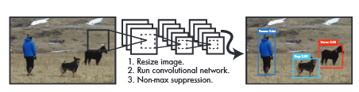
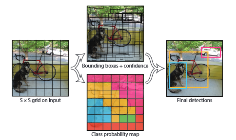
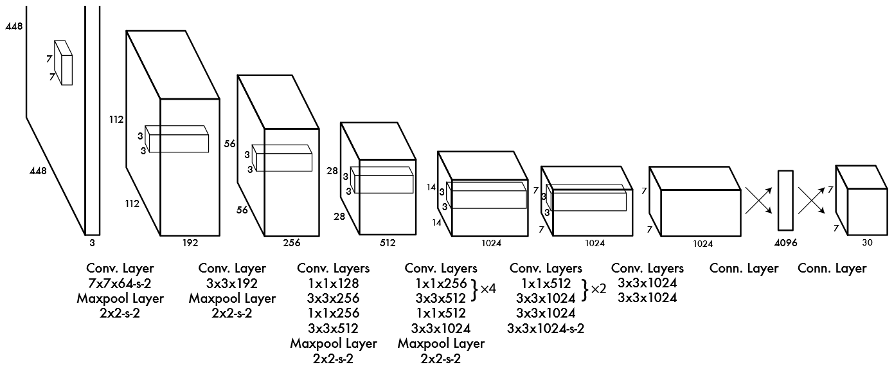

# You Only Look Once: Unified, Real-Time Object Detection

## 摘要   
我们提出YOLO，一种新的物体检测方法。以往的物体检测工作主要将分类器重新调整为检测器，而我们将物体检测视为一个回归问题，直接预测图像中的边界框和类别概率。一个神经网络通过一次评估从完整图像中直接预测边界框和类别概率。由于整个检测流程是一个单一的网络，因此可以直接针对检测性能进行端到端的优化。

我们的统一架构非常快。基础YOLO模型可实现每秒45帧的实时处理速度，而更小的Fast YOLO模型每秒处理帧数高达155，且其均值平均精度（mAP）是其他实时检测器的两倍。相比当前的检测系统，YOLO在定位上错误更多，但在背景上错误较少。最后，YOLO能学习到非常通用的对象表征。在从自然图像泛化到其他领域（如艺术作品）时，YOLO优于其他检测方法，包括DPM和R-CNN。

## 1. 引言  
人类能通过一瞥便迅速辨别图像中的对象、其位置及交互关系。人类视觉系统既快且准确，使我们能以极少的思考进行复杂任务，如驾驶。快速、准确的物体检测算法可以使计算机在没有特定传感器的情况下驾驶车辆，使辅助设备实时传达场景信息给用户，释放响应式通用机器人系统的潜力。

当前的检测系统主要通过调整分类器来实现检测。为了检测某个物体，这些系统会在测试图像的不同位置和尺度上使用分类器评估。诸如变形部件模型（DPM）等系统采用滑动窗口方法，在图像上均匀分布地运行分类器。

近年来，类似R-CNN的方法使用区域提案方法先生成图像中的潜在边界框，再对这些提议的边界框进行分类。分类后，进一步的处理会精细调整边界框、消除重复检测，并根据场景中的其他对象重新打分。这种复杂的流程不仅速度慢且难以优化，因为每个独立组件必须单独训练。

我们重新定义物体检测为一个回归问题，直接从图像像素到边界框坐标和类别概率。通过我们的系统，你仅需对图像“看一眼”（YOLO）便能预测出有哪些对象及其所在位置。

YOLO的流程简单明了（见图1）。单一的卷积神经网络同时预测多个边界框及其类别概率。YOLO在完整图像上进行训练，并直接优化检测性能。该统一模型在物体检测上有多个优点。

首先，YOLO速度极快。由于我们将检测视作回归问题，不需要复杂的流程。在测试时，只需将新的图像输入到神经网络中便能预测出检测结果。

---

YOLO的基础网络在Titan X GPU上运行时能够达到每秒45帧的速度，而更快速的版本在没有批处理的情况下能够达到每秒超过150帧的速度。这意味着我们可以实时处理视频流，延迟低于25毫秒。此外，YOLO的均值平均精度（mAP）比其他实时系统高出两倍以上。有关我们系统在网络摄像头上实时运行的演示，请访问我们的网站：[http://pjreddie.com/yolo/](http://pjreddie.com/yolo/)。

其次，YOLO在进行预测时能够基于整个图像进行全局分析。与基于滑动窗口和区域提案的方法不同，YOLO在训练和测试时都能观察到整个图像，因此能够隐含地编码类别的上下文信息以及它们的外观。Fast R-CNN（目前的顶级检测方法之一）会将图像中的背景区域误认为是物体，因为它无法看到更大的上下文信息。而YOLO的背景错误比Fast R-CNN少了一半。

第三，YOLO可以学习到可泛化的对象表示。当在自然图像上训练，并在艺术作品上测试时，YOLO优于DPM和R-CNN等顶级检测方法。由于YOLO具有很高的泛化能力，当应用于新的领域或意料之外的输入时，它不太容易出错。

然而，YOLO的精度仍然落后于最先进的检测系统。尽管它能够快速识别图像中的物体，但在精确定位某些物体（尤其是较小的物体）方面存在一定的困难。我们在实验中进一步探讨了这些权衡。

我们的所有训练和测试代码都是开源的，用户可以下载多种预训练模型。

---

## 2. 统一检测架构

我们将物体检测的各个组件整合为一个单一的神经网络。我们的网络使用整个图像的特征来预测每个边界框，并且能够同时预测图像中所有类别的所有边界框。这意味着我们的网络可以全局地考虑整个图像以及其中所有的物体。YOLO的设计实现了端到端的训练，同时具备实时的处理速度和较高的平均精度。

我们的系统将输入图像划分为一个S × S的网格。如果一个物体的中心落在某个网格单元中，则该单元负责检测该物体。

每个网格单元会预测B个边界框及其置信度分数。置信度分数反映了模型认为该框中包含物体的置信程度以及它对预测框的准确性评估。正式地，我们将置信度定义为Pr(Object) * IOU_truth_pred。如果该单元中不存在物体，则置信度分数应为零；否则，我们希望置信度分数等于预测框与真实框之间的交并比（IOU）。

每个边界框包含5个预测值：x, y, w, h，以及置信度。（x, y）表示框的中心坐标，相对于网格单元的边界。宽度和高度（w, h）是相对于整个图像的。最后，置信度预测表示预测框与任何真实框的IOU。

每个网格单元还会预测C个条件类别概率，即Pr(Class_i|Object)。这些概率是基于该网格单元包含物体的条件下预测的。我们只为每个网格单元预测一组类别概率，而不管该单元有多少个边界框。

在测试时，我们将条件类别概率与每个边界框的置信度预测相乘，得到特定类别的置信度分数：

$Pr(Class_i|Object) * Pr(Object) * IOU_{truth}^{pred} = Pr(Class_i) * IOU_{truth}^{pred}$

这使我们能够获得每个框的类别特定置信度分数。该分数不仅编码了该框中出现该类别的概率，还反映了预测框适合该物体的准确性。

### 2.1 网络设计

我们将此模型实现为一个卷积神经网络，并在PASCAL VOC检测数据集上进行评估。网络的初始卷积层从图像中提取特征，而全连接层则预测输出的类别概率和边界框坐标。

我们的网络架构受到GoogLeNet分类模型的启发。YOLO网络包含24个卷积层，后接2个全连接层。与GoogLeNet使用的Inception模块不同，我们仅使用1×1的卷积层进行特征空间的降维，随后是3×3的卷积层，类似于Lin等人提出的网络设计。整个网络架构如图3所示。

我们还训练了一个快速版本的YOLO（称为Fast YOLO），以进一步探索实时检测的边界。Fast YOLO的神经网络包含较少的卷积层（9层而非24层）以及较少的过滤器。除了网络大小之外，YOLO和Fast YOLO的所有训练和测试参数相同。

### 2.2 训练训练

我们在ImageNet的1000类竞赛数据集上预训练卷积层。在预训练时，我们使用图3中的前20层卷积层，后接一个平均池化层和一个全连接层。我们训练该网络约一周，并在ImageNet 2012验证集上实现了88%的单裁剪top-5准确率，这与Caffe的Model Zoo中的GoogLeNet模型相当。我们使用Darknet框架完成了所有训练和推理。

随后，我们将模型转化为检测任务。

为了改进性能，我们在预训练网络的基础上添加了四个卷积层和两个带有随机初始化权重的全连接层。由于检测任务往往需要细粒度的视觉信息，因此我们将网络的输入分辨率从224×224提高到448×448

我们的最终层不仅预测类别概率，还预测边界框坐标。我们将边界框的宽度和高度标准化为相对于图像的宽度和高度，以确保它们在0到1之间。同时，我们将边界框的x和y坐标参数化为某个网格单元位置的偏移值，因此它们也在0到1之间。

我们在最后一层使用线性激活函数，其他层则使用带泄漏的ReLU激活函数，定义如下：

$
\phi(x) = 
\begin{cases} 
x & \text{如果 } x > 0 \\
0.1x & \text{否则}
\end{cases}
$

我们优化模型输出的平方误差总和。我们选择平方误差是因为它易于优化，但这种方法并不完全符合我们最大化平均精度（mAP）的目标。它将定位误差与分类误差等权重处理，这可能不理想。此外，在每张图像中，许多网格单元不包含任何物体，这会将这些单元的置信度分数推向零，往往会使包含物体的单元的梯度信息变弱。这可能导致模型在训练早期出现不稳定。

为了缓解这种问题，我们提高了边界框坐标预测的损失，同时降低了不包含物体的框的置信度预测损失。我们使用两个参数：λ_coord和λ_noobj来实现这一点，分别设置为λ_coord=5和λ_noobj=0.5。

平方误差还会将大框和小框的误差等权重处理。理想的误差度量应反映出在大框中的小偏差相对无关紧要，但在小框中则会产生较大影响。为部分解决这一问题，我们预测边界框宽度和高度的平方根，而不是直接预测宽度和高度。

YOLO为每个网格单元预测多个边界框。在训练时，我们希望每个物体只由一个边界框预测器负责。因此，我们根据与真实框的最高当前IOU值来指定哪个预测器负责预测某个物体。这样，边界框预测器在特定尺寸、宽高比或物体类别的预测上会有不同的专长，从而提高了整体的召回率。

在训练过程中，我们优化以下多部分损失函数：

$
\lambda_{coord} \sum_{i=0}^{S^2} \sum_{j=0}^{B} 1^{obj}_{ij} \left[ (x_i - \hat{x}_i)^2 + 
(y_i - \hat{y}_i)^2 \right] + 
\lambda_{coord} \sum_{i=0}^{S^2} \sum_{j=0}^{B} 1^{obj}_{ij} \left[ \left( \sqrt{w_i} - \sqrt{\hat{w}_i} \right)^2 +
 \left( \sqrt{h_i} - \sqrt{\hat{h}_i} \right)^2 \right]+
 \sum_{i=0}^{S^2} \sum_{j=0}^{B} 1^{obj}_{ij} (C_i - \hat{C}_i)^2 +
  \lambda_{noobj} \sum_{i=0}^{S^2} \sum_{j=0}^{B} 1^{noobj}_{ij} (C_i - \hat{C}_i)^2 +
   \sum_{i=0}^{S^2} 1^{obj}_{i} \sum_{c \in classes} (p_i(c) - \hat{p}_i(c))^2
$

其中，$1^{obj}_i$ 表示在第i个网格单元中是否有物体，$1^{obj}_{ij}$ 表示第i个网格单元中第j个边界框预测器是否负责该预测。

注意，损失函数仅在网格单元中有物体时惩罚分类错误（因此先前提到的条件类概率适用），也仅当预测器负责该真实框时惩罚边界框坐标误差（即在该网格单元中具有最高的IOU的预测器负责该预测）。

我们在PASCAL VOC 2007和2012的数据集上的训练和验证集上训练网络约135个周期。在测试2012数据时，我们还使用了VOC 2007的测试数据进行训练。在整个训练过程中，我们使用批量大小64、动量0.9、衰减率0.0005。

我们的学习率安排如下：在前几个周期中，我们将学习率缓慢从$10^{-3}$ 提高到$10^{-2}$。如果直接从高学习率开始，模型往往会因梯度不稳定而发散。我们继续使用$10^{-2}$ 训练75个周期，然后用$10^{-3}$ 训练30个周期，最后用$10^{-4}$ 训练30个周期。

为防止过拟合，我们使用了dropout和大量的数据增强。第一个全连接层之后的dropout层（比例为0.5）可防止层间的共适应现象。在数据增强方面，我们引入了随机缩放和最高20%原始图像尺寸的平移。我们还在HSV色彩空间中随机调整图像的曝光和饱和度，幅度高达1.5倍。

---

### 2.3 推理

与训练时类似，为测试图像预测检测结果只需要一次网络评估。在PASCAL VOC数据集上，网络为每个图像预测98个边界框及其类别概率。YOLO在测试时非常快，因为它仅需要一次网络评估，而不像基于分类器的方法。

网格设计在边界框预测中强制实现空间多样性。通常情况下，很容易确定一个物体落在哪个网格单元，网络只为每个物体预测一个框。然而，对于一些较大的物体或位于多个单元边界的物体，可以由多个单元精确定位。非极大值抑制可以用于解决这些多重检测。虽然在YOLO中非极大值抑制对性能影响不大，但它为mAP增加了2-3%。

---

### 2.4 YOLO的局限性

YOLO在边界框预测上有较强的空间约束，因为每个网格单元只预测两个边界框，并且只能包含一个类别。这种空间约束限制了模型对邻近物体的检测数量。对于成群的小物体（如一群鸟），我们的模型表现较差。

由于模型通过数据学习来预测边界框，因此在应对新的或不常见的宽高比或物体配置时较难泛化。此外，由于架构在输入图像中进行了多次下采样，YOLO在预测边界框时使用的是相对粗糙的特征。

最后，虽然我们在近似检测性能的损失函数上进行训练，但该损失函数对小边界框和大边界框的误差一视同仁。大边界框中的小偏差通常影响不大，但小边界框中的小偏差对交并比（IOU）的影响更大。YOLO主要的误差来源是定位不准。

---

## 3. 与其他检测系统的比较

物体检测是计算机视觉的核心问题。检测流程通常从输入图像中提取一组稳健的特征（如Haar、SIFT、HOG或卷积特征），然后使用分类器或定位器在特征空间中识别物体。这些分类器或定位器可以通过滑动窗口遍历整个图像，也可以在图像的某些区域进行检测。我们将YOLO检测系统与多个顶级检测框架进行比较，重点分析关键的相似点和差异。

### 变形部件模型（DPM）  
变形部件模型（DPM）采用滑动窗口的方法进行物体检测。DPM使用一个分离的流程来提取静态特征、分类区域、为高得分区域预测边界框等。我们的系统用单一的卷积神经网络取代了这些不同的部分。该网络同时执行特征提取、边界框预测、非极大值抑制以及上下文推理。网络内联地训练特征，并针对检测任务进行优化。我们统一的架构使模型比DPM更快、更准确。

### R-CNN
R-CNN及其变体采用区域提案方法来寻找图像中的物体。Selective Search方法生成潜在边界框，卷积网络提取特征，支持向量机（SVM）对边界框进行评分，线性模型调整边界框，非极大值抑制消除重复检测。该复杂流程的每个阶段都需要独立调优，系统速度较慢，测试时间每张图像超过40秒。

YOLO与R-CNN有些相似。每个网格单元提出潜在边界框，并使用卷积特征对这些框评分。然而，我们的系统在网格单元提案中施加空间约束，帮助减少同一物体的多次检测。YOLO还提出了更少的边界框，每张图像约98个，而Selective Search约为2000个。最后，我们将这些独立的组件整合为一个联合优化的模型。

### 其他快速检测器
Fast R-CNN和Faster R-CNN专注于加速R-CNN框架，通过共享计算以及使用神经网络而非Selective Search来提议区域。尽管它们在速度和精度上优于R-CNN，但仍未达到实时性能。

许多研究聚焦于加速DPM流程，如通过加速HOG计算、使用级联以及将计算移至GPU。然而，只有30Hz DPM实现了实时性能。

相较于优化大型检测流程的各个部分，YOLO直接抛弃了这种流程，从设计上实现了快速检测。

针对单类（如人脸或人体）的检测器可高度优化，因为它们需处理的变化较少。YOLO则是一个通用的检测器，能够同时学习检测各种对象。

### Deep MultiBox
与R-CNN不同，Szegedy等人训练了一个卷积神经网络来预测感兴趣区域，而不是使用Selective Search。MultiBox也可以通过用单类预测代替置信度预测来执行单一对象检测。然而，MultiBox无法进行通用物体检测，仍只是一个较大的检测流程的一部分，且需要进一步的图像分块分类。YOLO和MultiBox都使用卷积网络预测图像中的边界框，但YOLO是一个完整的检测系统。

### OverFeat
Sermanet等人训练了一个卷积神经网络进行定位，并将该定位器改为检测器。OverFeat高效地执行滑动窗口检测，但它仍然是一个分离的系统。OverFeat优化的是定位，而非检测性能。与DPM类似，OverFeat在做出预测时只能看到局部信息，因而需要大量后处理才能生成连贯的检测结果。

### MultiGrasp
我们的工作在设计上与Redmon等人的抓取检测工作相似。我们采用的基于网格的边界框预测方法基于MultiGrasp系统的抓取回归。然而，抓取检测比物体检测要简单得多。MultiGrasp只需在包含一个物体的图像中预测一个可抓取的区域。它不需要估计物体的大小、位置或边界，也不需要预测类别，只需找到一个适合抓取的区域。而YOLO则在图像中预测多个对象的边界框和类别概率。

---

## 4. 实验

首先，我们在PASCAL VOC 2007数据集上将YOLO与其他实时检测系统进行比较。为了深入了解YOLO与R-CNN变体的差异，我们分析了YOLO和Fast R-CNN在VOC 2007上的错误，Fast R-CNN是R-CNN的高性能版本之一。基于不同的错误分析，我们展示了YOLO可以用来重新评分Fast R-CNN的检测结果，减少背景错误，从而显著提升性能。我们还展示了VOC 2012的数据集结果，并将平均精度（mAP）与当前最先进的方法进行比较。最后，我们证明了YOLO在新领域中的泛化能力优于其他检测器，在两个艺术作品数据集上也表现良好。

### 4.1 与其他实时系统的比较

在物体检测中，许多研究工作致力于加速标准的检测流程。然而，只有Sadeghi等人真正构建了一个可以达到实时性能（每秒30帧或更高）的检测系统。我们将YOLO与他们的GPU实现的DPM进行比较，该系统的速度为30Hz或100Hz。虽然其他方法没有达到实时性能的标准，但我们仍然比较了它们的mAP和速度，以观察不同检测系统中精度和性能的权衡。

Fast YOLO是PASCAL VOC上最快的物体检测方法，据我们所知，它是现存的最快的物体检测器。Fast YOLO的mAP为52.7%，比以往的实时检测方法的准确度高出一倍多。YOLO的mAP达到了63.4%，且依然能够保持实时性能。

我们还使用VGG-16网络训练了YOLO。这种模型更为准确，但速度也显著低于YOLO。尽管该模型精度较高，但由于它无法满足实时性能的要求，本文接下来的部分将重点讨论我们更快速的模型。

### PASCAL VOC 2007实时检测系统性能对比表

| 系统                    | 训练数据 | mAP  | FPS |
|-----------------------|----------|------|-----|
| 100Hz DPM             | 2007     | 16.0 | 100 |
| 30Hz DPM              | 2007     | 26.1 | 30  |
| Fast YOLO             | 2007+2012| 52.7 | 155 |
| YOLO                  | 2007+2012| 63.4 | 45  |
| Fastest DPM           | 2007     | 30.4 | 15  |
| R-CNN Minus R         | 2007     | 53.5 | 6   |
| Fast R-CNN            | 2007+2012| 70.0 | 0.5 |
| Faster R-CNN VGG-16   | 2007+2012| 73.2 | 7   |
| Faster R-CNN ZF       | 2007+2012| 62.1 | 18  |
| YOLO VGG-16           | 2007+2012| 66.4 | 21  |

在上述对比中，Fast YOLO在PASCAL VOC检测任务中是最快的检测器，并且其准确率是其他实时检测器的两倍以上。YOLO的准确率比Fast YOLO高10 mAP，但依然保持在实时速度以上。

---

### 4.2 VOC 2007 错误分析

为了进一步分析YOLO和当前最先进的检测器之间的差异，我们对VOC 2007的结果进行了详细分析。我们将YOLO与Fast R-CNN进行对比，因为Fast R-CNN是PASCAL上的高性能检测器之一，且其检测结果是公开的。

在测试时，对于每个类别，我们查看该类别的前N个预测。每个预测要么是正确的，要么根据错误类型被分类为以下几类：

- **正确** ：类别正确且$IOU > 0.5$  
- **定位错误**：类别正确，$0.1 < IOU < 0.5$ 
- **相似类别错误**：类别相似，$IOU > 0.1 $
- **其他类别错误**：类别错误，$IOU > 0.1 $
- **背景错误**：与任何物体的$IOU < 0.1 $

图4显示了所有20个类别中每种错误类型的比例。

YOLO在正确定位物体方面存在困难。YOLO的错误中，定位错误占比最高，远超其他错误来源。Fast R-CNN的定位错误较少，但其背景错误更多。13.6%的Fast R-CNN的顶级检测结果是错误地检测为物体的背景区域。相较而言，Fast R-CNN出现背景错误的概率几乎是YOLO的3倍。

---

### 4.3 将Fast R-CNN与YOLO结合

YOLO在背景检测错误方面显著少于Fast R-CNN。通过利用YOLO来消除Fast R-CNN中的背景检测错误，我们可以显著提升检测性能。对于R-CNN预测的每个边界框，我们检查YOLO是否预测了一个相似的边界框。如果是，我们会根据YOLO预测的概率和两个边界框的重叠程度提升该预测的分数。

Fast R-CNN在VOC 2007测试集上的mAP为71.8%。当与YOLO结合后，其mAP提高了3.2%，达到了75.0%。我们还尝试将性能最高的Fast R-CNN模型与其他版本的Fast R-CNN组合。这些组合使mAP略微增加了0.3%到0.6%，详细结果请见表2。

YOLO的提升并非仅仅是模型集成的副产品，因为结合不同版本的Fast R-CNN效果不大。相反，正是因为YOLO在测试时犯了不同类型的错误，这种组合才有效地提升了Fast R-CNN的性能。

不幸的是，这种组合并未充分利用YOLO的速度优势，因为我们需要分别运行每个模型并结合结果。然而，由于YOLO速度很快，相比于Fast R-CNN，它不会增加显著的计算时间。

| 模型                    | 组合后mAP | 提升幅度 |
|------------------------|-----------|----------|
| Fast R-CNN             | 71.8      | -        |
| Fast R-CNN（2007数据） | 72.4      | +0.6     |
| Fast R-CNN（VGG-M）    | 72.4      | +0.6     |
| Fast R-CNN（CaffeNet） | 72.1      | +0.3     |
| YOLO                   | 75.0      | +3.2     |

---

### 4.4 VOC 2012结果

在VOC 2012测试集上，YOLO的mAP为57.9%。这一结果虽低于当前的最先进水平，但接近使用VGG-16的原始R-CNN。我们的系统在检测小物体方面表现较弱，尤其是在瓶子、绵羊和电视/显示器等类别上，YOLO的分数比R-CNN或Feature Edit低8-10%。然而，在猫和火车等类别上，YOLO的表现更好。

我们的Fast R-CNN + YOLO组合模型是性能最好的检测方法之一。Fast R-CNN通过与YOLO结合获得了2.3%的mAP提升，在公共排行榜上提升了5个位置。

### 4.5 通用性：艺术作品中的人检测

我们对YOLO的通用性进行了评估，特别是在艺术作品中检测人类对象的能力。我们使用了一组艺术作品图像，这些图像包含了各种风格和表现形式的人物。尽管这些图像与我们在训练中使用的自然场景存在显著差异，但YOLO仍然能够有效地检测出人类对象。这种能力部分得益于YOLO的训练过程，其考虑了不同场景和上下文下的物体检测。

为了进一步评估模型的表现，我们对比了YOLO在艺术作品中检测人类的结果与其他传统方法的效果。结果显示，YOLO在检测精度和速度上均优于这些传统方法。这表明YOLO在跨域应用中的强大适应能力和通用性，能够处理自然图像和艺术作品中的目标检测任务。

总之，YOLO在艺术作品中的人检测表现出色，验证了其在多种背景下的应用潜力，进一步支持了我们提出的统一目标检测框架的有效性。
