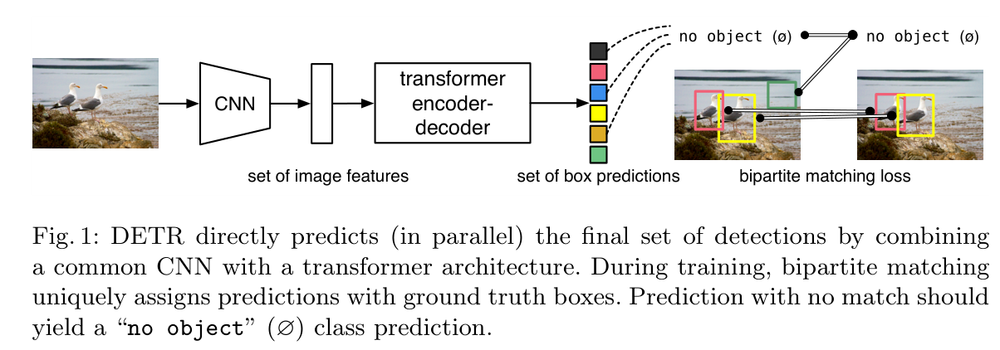
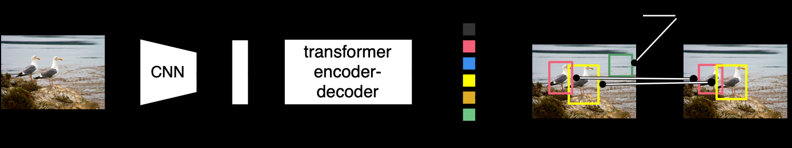

# 基于Transformer的端到端目标检测

## 摘要

我们提出了一种新方法，将目标检测视为一个直接的集合预测问题。我们的方法简化了检测流程，去除了许多手工设计的组件，例如非极大值抑制（NMS）或锚点生成，这些组件通常用于编码我们对任务的先验知识。这种新框架名为DEtection TRansformer（DETR），其核心成分包括一个基于集合的全局损失函数，通过双边匹配来强制唯一预测，以及一个transformer编码器-解码器架构。给定一组固定数量的学习到的目标查询，DETR可以基于物体之间的关系和全局图像上下文，平行输出最终的预测集合。这种新模型在概念上较为简单，不需要像许多其他现代检测器那样依赖于专门的库。DETR在COCO目标检测数据集上展示了与经过高度优化的Faster R-CNN基准相当的准确性和运行效率。此外，DETR可以轻松扩展，以统一的方式生成全景分割。实验结果表明，该方法显著超越了竞争基准。训练代码和预训练模型已在[https://github.com/facebookresearch/detr](https://github.com/facebookresearch/detr)提供。

---

## 1. 引言

目标检测的任务是为每个感兴趣的物体预测一组边界框和类别标签。现代的检测器通过在大量的候选区域、锚点或窗口中心上定义回归和分类问题，间接解决了这个集合预测任务。它们的性能受到后处理步骤（例如去除近似重复预测）、锚点集设计以及为锚点分配目标框的启发式算法的显著影响。为简化这些流程，我们提出了一种直接的集合预测方法，以避开间接任务。尽管这种端到端的哲学已在复杂的结构化预测任务（如机器翻译或语音识别）中取得显著进展，但在目标检测中仍未被充分应用：之前的尝试或多或少地依赖于其他形式的先验知识，或未能在有挑战性的基准上证明其竞争力。本文旨在弥补这一差距。

我们通过将目标检测视为一个直接的集合预测问题来简化训练流程。我们的模型采用基于transformer的编码器-解码器架构【47】，transformer是一种广泛应用于序列预测的架构。transformer的自注意力机制可以显式建模序列中元素之间的所有成对交互，这使其非常适合处理集合预测任务中的特定约束，例如去除重复预测。

我们的DEtection TRansformer（DETR，见图1）一次性预测所有目标，并使用集合损失函数进行端到端训练，该损失函数通过双边匹配将预测和真实框一一对应。DETR通过省略多种手工设计的组件（如空间锚点或非极大值抑制）来简化检测流程。与大多数现有检测方法不同，DETR不需要任何自定义层，因此在包含标准卷积神经网络（CNN）和transformer类的框架中可以轻松复现。

与大多数直接集合预测的先前工作相比，DETR的主要特点是结合了双边匹配损失和具有非自回归平行解码的transformer【29,12,10,8】。相比之下，之前的工作集中于使用RNN进行自回归解码【43,41,30,36,42】。我们的匹配损失函数可以将预测唯一地分配给真实目标对象，并且对预测对象的排列不敏感，因此可以并行生成这些预测。

我们在流行的目标检测数据集COCO【24】上对DETR进行了评估，并与竞争激烈的Faster R-CNN基准【37】进行了对比。Faster R-CNN自最初发表以来经过了多次设计迭代，其性能得到了极大提升。我们的实验表明，新的DETR模型能够达到可比的性能。更具体地说，DETR在大目标检测上表现显著更优，这可能得益于transformer的非局部计算。然而，在小目标检测上的表现稍逊一筹。我们预计，未来的工作将改善这一点，正如FPN【22】的开发提升了Faster R-CNN的性能一样。

DETR的训练设置与标准目标检测器在多个方面有所不同。新模型需要较长的训练时间，并受益于transformer中的辅助解码损失。我们对哪些组件对于模型性能至关重要进行了深入探讨。

DETR的设计理念可以轻松扩展至更复杂的任务。在我们的实验中，基于预训练的DETR训练的简单分割头，在全景分割【19】这一具有挑战性的像素级识别任务中，超越了其他竞争基准。

---

## 2. 相关工作

我们的研究基于几个领域的先前工作：集合预测的双边匹配损失、基于transformer的编码器-解码器架构、并行解码以及目标检测方法。

## 2.1 集合预测

在深度学习中，尚未出现一种标准模型来直接进行集合预测。基本的集合预测任务是多标签分类（例如在计算机视觉中的引用【40,33】），常见的基准方法是一对多的（one-vs-rest）方法，但该方法不适用于检测这类具有元素间结构关系（即近似的边界框）的任务。此类任务的首要难点是避免重复检测。目前大多数检测器通过非极大值抑制（NMS）等后处理来解决这个问题，而直接集合预测则不依赖于后处理。此类模型需要全球推理机制，能够对所有预测元素之间的交互进行建模以避免冗余。对于固定大小的集合预测，密集全连接网络【9】尽管代价高昂，但足够完成任务。一种通用方法是使用自回归序列模型，如循环神经网络（RNN）【48】。无论采用何种方法，损失函数应对预测结果的排列保持不变。通常的解决方案是设计基于匈牙利算法【20】的损失，以便在真实标注和预测之间找到双边匹配，从而保证每个目标元素都有唯一的匹配。我们采用这种双边匹配损失的方法，与大多数先前的工作不同，我们不使用自回归模型，而是使用具有并行解码功能的transformer，具体如下所述。

## 2.2 Transformer和并行解码

Transformer由Vaswani等人【47】提出，作为一种基于注意力的新架构用于机器翻译。注意力机制【2】是一种神经网络层，用于从整个输入序列中聚合信息。Transformer引入了自注意力层，这种层类似于非局部神经网络【49】，通过扫描序列的每个元素并更新它，以聚合来自整个序列的信息。注意力模型的主要优点是其全局计算和完美的记忆力，使其比RNN更适合处理长序列。如今，Transformer正逐步取代RNN，广泛应用于自然语言处理、语音处理和计算机视觉【8,27,45,34,31】。

Transformer最初用于自回归模型，生成输出序列时逐一生成元素。然而，受限于推理成本（与输出长度成正比，难以批处理），逐步发展出并行序列生成技术，广泛应用于音频【29】、机器翻译【12,10】、词表示学习【8】，以及最近的语音识别【6】。我们同样结合了Transformer和并行解码，以在计算成本和全局计算需求之间找到适合集合预测的权衡。

## 2.3 目标检测

大多数现代目标检测方法基于初始估计进行预测。两阶段检测器【37,5】根据候选区域预测边界框，而单阶段方法基于锚点【23】或可能的目标中心点网格【53,46】进行预测。近期研究【52】表明，这些系统的最终性能在很大程度上依赖于这些初始估计的具体设定方式。在我们的模型中，我们能够去除这种手工设计的过程，通过直接预测相对于输入图像的绝对边界框来简化检测流程，而不是依赖锚点。

集合损失：若干目标检测器【9,25,35】采用双边匹配损失。然而，在这些早期的深度学习模型中，不同预测之间的关系仅由卷积或全连接层建模，且设计非最大抑制后处理可进一步提高性能。最新的检测器【37,23,53】采用非唯一的匹配规则，将真实标注和预测之间的关系与NMS相结合。

可学习的NMS方法【16,4】和关系网络【17】通过注意力机制显式建模不同预测之间的关系。直接采用集合损失，这些方法不需要任何后处理步骤。然而，这些方法采用额外手工设计的上下文特征（如候选框坐标）来有效地建模检测之间的关系，而我们寻求一种尽可能减少模型中先验知识的方法。

循环检测器：与我们的方法最相近的是用于目标检测【43】和实例分割【41,30,36,42】的端到端集合预测。与我们类似，这些方法使用双边匹配损失和基于卷积神经网络（CNN）激活的编码器-解码器架构直接生成边界框。然而，这些方法仅在小规模数据集上进行了评估，且未与现代基准进行对比，尤其是它们基于自回归模型（更确切地说是RNN），因此未能利用具有并行解码功能的最新Transformer。

## 3. DETR模型

为了在检测任务中实现直接的集合预测，需要两个关键成分：(1) 强制预测和真实框之间进行唯一匹配的集合预测损失；(2) 一个能够一次性预测一组物体并且建模物体之间关系的架构。我们在图2中详细展示了我们的架构。

## 3.1 目标检测集合预测损失

DETR通过解码器的一次前向传播推断出一个固定大小的预测集合，其中集合大小$N$远大于图像中的目标数量。训练的主要难点是如何针对真实目标对预测的物体（类别、位置、大小）进行评分。我们的损失通过在预测和真实目标之间找到最优的双边匹配，然后优化每个物体特定的（边界框）损失来解决此问题。

设$y$ 表示真实目标集合，预测集合为$\hat{y} = \{\hat{y}_i\}_{i=1}^N$。假设$N$大于图像中的实际目标数量，我们将真实目标集合$y$扩展为大小为$N$的集合，使用特殊类别∅（无目标）填充。为在两个集合之间找到双边匹配，我们寻找拥有最低成本的$N$元素排列$\sigma \in S_N$：

$
\hat{\sigma} = \arg \min_{\sigma \in S_N} \sum_{i=1}^N L_\text{match}(y_i, \hat{y}_{\sigma(i)}),
$

其中$L_\text{match}(y_i, \hat{y}_{\sigma(i)})$是真实目标$y_i$和预测$\hat{y}_{\sigma(i)}$之间的成对匹配成本。这个最优分配可以通过匈牙利算法高效地计算【43】。

匹配成本同时考虑了类别预测和预测框与真实框的相似性。每个真实目标$y_i$可以表示为$y_i = (c_i, b_i)$，其中$c_i$是目标类别标签（可以是 ∅），$b_i \in [0,1]^4$是相对于图像大小的目标框的中心坐标、高度和宽度。对于预测$\hat{y}_{\sigma(i)}$，我们定义类别$c_i$的预测概率为$\hat{p}_{\sigma(i)}(c_i)$，预测框为$\hat{b}_{\sigma(i)}$。用这些记号可以定义成对匹配损失：

$
L_\text{match}(y_i, \hat{y}_{\sigma(i)}) = -1\{c_i \neq ∅\} \hat{p}_{\sigma(i)}(c_i) + 1\{c_i \neq ∅\}L_\text{box}(b_i, \hat{b}_{\sigma(i)}),
$

其中$L_\text{box}$是用于评分边界框的损失函数。

该匹配过程在现代检测器中起到了类似作用，这些检测器通过启发式分配规则将候选区域【37】或锚点【22】与真实目标进行匹配。不同的是，直接的集合预测要求一对一匹配，以避免重复。

第二步是对在上一步中匹配到的每一对计算损失函数，即计算所有匹配对的匈牙利损失。我们的损失与通用目标检测器的损失类似，是类别预测负对数似然和后文定义的框损失的线性组合：

$
L_\text{Hungarian}(y, \hat{y}) = \sum_{i=1}^N \left[ -\log \hat{p}_{\hat{\sigma}(i)}(c_i) + 1\{c_i \neq ∅\}L_\text{box}(b_i, \hat{b}_{\hat{\sigma}(i)}) \right],
$

其中$\hat{\sigma}$是第一步中计算得到的最优匹配。在实践中，当$c_i = ∅$时，我们将对数概率项的权重降低10倍，以平衡类别不平衡。这类似于Faster R-CNN中通过子采样来平衡正/负候选框的方法【37】。

**边界框损失**：匹配损失和匈牙利损失的第二部分是$L_\text{box}(·)$，用于对边界框进行评分。与许多检测器采用相对于某些初始估计的$\Delta$进行框预测不同，我们直接进行框预测。虽然这种方法简化了实现，但在损失的相对尺度上存在问题。常用的$\ell_1$损失在小框和大框上会有不同的尺度，即使其相对误差相同。为解决此问题，我们将$\ell_1$损失和广义 IoU 损失【38】的线性组合定义为我们的框损失：

$
L_\text{box}(b_i, \hat{b}_{\sigma(i)}) = \lambda_\text{iou}L_\text{iou}(b_i, \hat{b}_{\sigma(i)}) + \lambda_{L1}\|b_i - \hat{b}_{\sigma(i)}\|_1,
$

其中$\lambda_\text{iou}$和$\lambda_{L1}$是超参数。损失被所有批次中的目标数量进行归一化。

---

## 3.2 DETR架构

DETR架构非常简单，如图2所示。它主要包含三个部分：用于提取紧凑特征表示的CNN主干网络、transformer的编码器-解码器，以及用于生成最终检测预测的简单前馈网络（FFN）。下面对这三个主要组件进行描述：

- **主干网络**。从初始图像$x_{\text{img}} \in \mathbb{R}^{3 \times H_0 \times W_0}$（包含3个颜色通道）开始，一个常规的CNN主干网络生成一个低分辨率的激活图$f \in \mathbb{R}^{C \times H \times W}$。我们通常的参数取值为$C = 2048$，$H, W = H_0 / 32, W_0 / 32$。
- **Transformer编码器**。首先，1×1卷积将高层激活图$f$的通道数从$C$降低到一个更小的维度$d$，生成新的特征图$z_0 \in \mathbb{R}^{d \times H \times W}$。编码器期望输入的是一个序列，因此我们将$z_0$的空间维度折叠为一维，形成$d \times HW$的特征图。每层编码器都采用标准架构，由一个多头自注意力模块和一个前馈网络（FFN）组成。由于transformer架构对序列中的元素顺序不敏感，因此我们使用固定的**位置编码**【31,3】将其添加到每层注意力层的输入中。关于架构的详细定义，请参考【47】。
- 

DETR使用传统的CNN主干来学习输入图像的2D表示。该模型将其展平，并在将其传递到变压器编码器之前用位置编码对其进行补充。然后，转换器解码器将少量固定数量的学习位置嵌入 (我们称之为对象查询) 作为输入，并另外处理编码器输出。我们将解码器的每个输出嵌入传递到共享的前馈网络 (FFN)，该网络预测检测 (类和边界框) 或 “无对象” 类。

- **Transformer解码器**。解码器遵循transformer的标准架构，利用多头自注意力和编码器-解码器注意力机制，转换$N$个大小为$d$的嵌入。与原始transformer不同的是，我们的模型在每层解码器中并行解码$N$个物体，而Vaswani等人【47】的自回归模型则是按顺序逐个预测输出序列。对于不熟悉transformer概念的读者，可以参考附录材料。由于解码器对输入的排列也是不敏感的，输入的$N$个嵌入必须不同，以确保生成不同的结果。我们称这些输入嵌入为**目标查询**（object queries），它们是学习得到的**位置编码**，并与编码器输出一起输入每层注意力层。解码器将$N$个目标查询转化为输出嵌入，然后通过前馈网络（见下一小节）分别解码为边界框坐标和类别标签，最终生成$N$个预测。通过对这些嵌入的自注意力和编码器-解码器注意力，模型可以利用图像整体的上下文信息，在生成预测时对所有物体的关系进行全局建模。
- **前馈网络（FFNs）**。最终的预测由一个三层感知器网络生成，使用ReLU激活函数和隐藏层维度$d$，并通过线性投影层完成预测。FFN预测边界框相对于输入图像的中心坐标、高度和宽度的归一化值，线性层则使用softmax函数预测类别标签。由于我们预测的边界框集合大小固定为$N$，且通常大于图像中实际存在的目标数量，因此我们引入一个特殊类别 ∅（无目标）来表示在某个槽位未检测到任何物体。这一类别在标准目标检测方法中类似于“背景”类别的作用。
- **辅助解码损失**。我们发现，在训练过程中，在每层解码器后使用辅助损失【1】对模型预测每个类别的正确数量尤为有帮助。我们在每层解码器后添加预测FFN，并计算匈牙利损失。所有预测FFN共享参数。我们使用额外的共享层归一化，将来自不同解码器层的输入归一化为预测FFN。

---

## 4. 实验

我们通过在COCO数据集上进行定量评估，证明了DETR相较于Faster R-CNN的竞争力。接着，我们对DETR架构和损失函数进行了详细的消融研究，提供了实验洞察和定性结果。最后，为展示DETR的通用性和扩展性，我们在全景分割任务上展示了结果，实验中仅在一个固定的DETR模型上进行了小的扩展。我们提供代码和预训练模型，便于复现我们的实验，代码地址为[https://github.com/facebookresearch/detr](https://github.com/facebookresearch/detr)。

## 数据集

我们在COCO 2017的检测和全景分割数据集上进行了实验，这些数据集包含了118,000张训练图像和5,000张验证图像。每张图像均被标注了边界框和全景分割标签。每张图像平均有7个目标，最多一张图像包含63个实例，并且在同一图像上存在从小到大的目标对象。如果没有特别说明，我们将使用平均精度（AP）作为bbox AP的指标，即多阈值的积分度量。为了与Faster R-CNN进行对比，我们报告了最后一个训练周期的验证集AP；对于消融实验，我们报告了最后10个周期验证集结果的中位数。

## 技术细节

我们使用AdamW优化器【26】，将transformer的初始学习率设为$10^{-4}$，主干网络的学习率设为$10^{-5}$，权重衰减为$10^{-4}$。所有transformer权重使用Xavier初始化【11】，主干网络使用来自torchvision的ImageNet预训练ResNet模型，批归一化层被冻结。我们报告了使用两种不同主干网络的结果：ResNet-50和ResNet-101，分别称为DETR和DETR-R101。按照【21】的方法，我们通过在主干网络的最后一个阶段添加一个卷积扩张并移除该阶段的第一个卷积的步幅来增加特征分辨率。对应的模型分别称为DETR-DC5和DETR-DC5-R101（表示具有扩张C5阶段的模型）。这种修改使得分辨率提高了两倍，从而提升了小目标的性能，但代价是编码器中的自注意力开销增加了16倍，导致整体计算成本增加两倍。表1中详细对比了这些模型与Faster R-CNN的计算开销（FLOPS）。

我们使用了尺度增强，将输入图像调整为最短边至少480像素，最长边至多800像素，而最长边至多为1333像素【50】。为了通过编码器的自注意力学习全局关系，我们在训练中还应用了随机裁剪增强，这使得性能提高了约1个AP。具体来说，训练图像有0.5的概率裁剪成随机矩形区域，然后重新调整大小至800-1333像素。transformer训练时采用默认的0.1的dropout。在推理时，某些槽会预测为空类别。为了优化AP，我们将这些槽的预测覆盖为置信度第二高的类别，并使用相应的置信度。这一操作相比于直接过滤空槽提高了2个AP。其他训练的超参数可以在附录A.4部分找到。在消融实验中，我们采用300个训练周期的训练计划，在200个周期后学习率降低10倍，每个周期包含一轮所有训练图像的遍历。在16块V100 GPU上训练300个周期的基线模型需要3天时间，每块GPU处理4张图像（总批大小为64）。为了与Faster R-CNN对比，我们采用了500个周期的较长训练计划，在400个周期后降低学习率。与短计划相比，该计划增加了1.5 AP。

## 4.1 与Faster R-CNN的对比

transformer通常通过Adam或Adagrad优化器在极长的训练时间和dropout下训练，这对于DETR同样适用。然而，Faster R-CNN则通过随机梯度下降（SGD）和极少的数据增强进行训练，我们尚未见到使用Adam或dropout成功应用于该模型的案例。尽管存在这些差异，我们尝试尽可能使Faster R-CNN基线更强。为使其与DETR一致，我们在边界框损失中添加了广义IoU【38】，并采用相同的随机裁剪增强以及长训练计划，这已被证实可以提升性能【13】。结果如表1所示。表1顶部部分展示了Detectron2模型库【50】中采用3×训练计划的Faster R-CNN结果。中间部分展示了相同模型的增强版结果（标记为“+”），使用9×训练计划（109个周期）和上述增强，总体提升了1-2 AP。表1最后部分展示了多个DETR模型的结果。为了在参数数量上具有可比性，我们选择了一个包含6个transformer和6个解码器层、宽度为256且有8个注意力头的模型。与Faster R-CNN结合FPN的模型一样，这一模型有41.3M参数，其中23.5M在ResNet-50中，17.8M在transformer中。尽管Faster R-CNN和DETR都可能通过更长时间的训练进一步提升性能，我们可以得出DETR可以在相同参数数量下与Faster R-CNN相媲美的结论，其在COCO验证集上达到了42 AP。DETR的AP表现显著提高了7.8，在大型物体上的表现较好，然而在小型物体的表现则有待提高。与同样参数数量和计算成本的DETR-DC5相比，它的表现稍高，但在小型物体检测方面仍然较弱。使用ResNet-101主干的Faster R-CNN和DETR表现出相当的结果。

## 4.2 消融实验

在DETR中，transformer解码器的注意力机制是关键组件，它负责建模不同检测之间的特征关系。在消融分析中，我们研究了DETR架构和损失函数中其他组件对最终性能的影响。为此，我们选择了基于ResNet-50的DETR模型，包含6层编码器、6层解码器、宽度为256的transformer。该模型有41.3M个参数，在短期和长期训练计划中分别达到了40.6 AP和42.0 AP，运行速度为28 FPS，与具有相同主干的Faster R-CNN-FPN相当。

**编码器层数**。我们通过改变编码器层数来评估全局图像级自注意力的重要性（见表2）。在没有编码器层的情况下，整体AP下降了3.9点，其中大型物体AP下降了6.0点。我们推测，编码器的全局场景推理对于解开物体的纠缠关系非常重要。在图3中，我们可视化了经过训练的模型中最后一层编码器的注意力图，聚焦于图像中的某些点。编码器似乎已经能够分离出各个实例，这可能简化了解码器的物体提取和定位任务。

**解码器层数**。由于我们在每层解码器之后应用辅助损失（见3.2节），预测FFN在设计上被训练为从每一层解码器的输出中预测物体。我们通过评估每层解码时预测的物体，来分析每层解码器的作用（见图4）。AP和AP50在每层后均有所提升，从第一层到最后一层共提升了8.2和9.5 AP。DETR无需非极大值抑制（NMS），这在设计上就是如此。为了验证这一点，我们对每层解码器的输出运行标准NMS过程，使用默认参数【50】。结果显示，在第一层解码器输出上，NMS提升了模型性能。原因可能是单层解码器无法计算输出元素之间的交叉关系，因此容易对同一物体做出多次预测。而在第二层及后续层中，自注意力机制使模型能够抑制重复预测。我们观察到，随着深度增加，NMS带来的性能提升逐渐减小。在最后几层中，NMS会错误地去除正确预测的目标，导致AP轻微下降。

与可视化编码器注意力类似，我们在图6中可视化了解码器的注意力，为每个预测的物体着色。我们发现解码器的注意力主要是局部的，意味着它主要集中在物体的极限区域，如头部或四肢。我们推测，在编码器已通过全局注意力分离各个实例后，解码器只需关注这些极限区域，以提取类别和物体边界。

**前馈网络的重要性**。transformer中的FFN可以视为1×1卷积层，使得编码器类似于增强了注意力的卷积网络【3】。我们尝试完全去除FFN，仅保留transformer层中的注意力机制。此时网络参数减少至28.7M，其中10.8M在transformer中，性能下降了2.3 AP，因此我们认为FFN对于取得良好效果至关重要。

**位置编码的重要性**。在我们的模型中有两种位置编码：空间位置编码和输出位置编码（目标查询）。我们进行了不同组合的实验，结果见表3。输出位置编码是必需的，无法移除，因此我们实验了在解码器输入时传递位置编码，或在每层注意力层上添加位置编码的效果。在第一个实验中，我们完全移除空间位置编码，并仅在解码器输入时传递输出位置编码，结果显示模型仍达到了32 AP，较基线下降了7.8 AP。接着，我们在输入时传递固定的正弦空间位置编码和输出编码，结果显示与每层注意力中传递位置编码相比，AP降低了1.4点。学习的空间编码在注意力层中传递时，得到的结果相似。令人意外的是，不在编码器中传递任何空间编码仅导致1.3 AP的轻微下降。实验中我们共享跨所有层的注意力中传递的编码，且输出编码（目标查询）始终是学习得到的。

综合这些消融实验结果，我们得出transformer组件，包括编码器中的全局自注意力、FFN、多层解码器和位置编码，都对最终的目标检测性能有显著贡献。

## 4.3 分析

**解码器输出槽分析** 在图7中，我们可视化了所有图像在COCO 2017验证集上由DETR解码器的20个预测槽中的每一个生成的框。每个框预测都被表示为一个点，其中心坐标位于单位方形中（由图像大小归一化）。点的颜色编码表示框的大小，其中绿色表示小框，红色表示大的水平框，蓝色表示大的垂直框。我们观察到，每个槽都会针对某些特定的区域和框大小进行不同模式的预测。特别是，几乎所有的槽都有预测图像宽框的模式（在图中间的红色点可见）。我们假设这与COCO数据集中目标的分布有关。

**泛化至未见过的实例数量**。在COCO数据集中，某些类别在单幅图像中没有出现过大量实例。例如，训练集中没有图像包含超过13只长颈鹿。我们创建了一张合成图像来验证DETR的泛化能力（见图5）。我们的模型能够找到图像中的所有24只长颈鹿，这显然超出了训练分布。这个实验表明，模型中的每个目标查询并没有严格的类别专用性。

## 4.4 DETR在全景分割任务中的应用

全景分割【19】近年来受到了计算机视觉社区的广泛关注。类似于将Faster R-CNN扩展为Mask R-CNN【14】，DETR可以通过在解码器输出顶部添加一个掩码头，扩展为全景分割模型。在本节中，我们展示了这样的头部能够生成全景分割【19】结果，通过统一的方式处理“物体”类和“场景”类。我们的实验在COCO数据集的全景标注上进行，该数据集包含53种场景类别和80种物体类别。

我们在COCO数据集上训练DETR模型，以检测“物体”和“场景”类的边界框，使用相同的训练方法。预测边界框是训练的必要部分，因为匈牙利匹配需要基于边界框之间的距离来计算。我们还添加了一个掩码头，该头部为每个预测的边界框生成一个二值掩码，如图8所示。掩码头以每个物体的transformer解码器输出为输入，通过多头（M个头）注意力机制计算每个物体的编码器输出注意力热图，每个物体生成M个小分辨率的注意力热图。为了进行最终的预测并提高分辨率，我们使用了一个类似FPN的架构。掩码的最终分辨率为步幅4，每个掩码独立地通过DICE/F-1损失【28】和Focal损失【23】进行监督。

掩码头可以与检测模型联合训练，或者通过两步流程训练：首先仅对DETR模型进行边界框检测训练，然后固定所有权重，只训练掩码头25个周期。实验表明，这两种方法的效果相似，我们报告的是后者的结果，因为这种方法训练时间更短。

---

**训练细节**。我们在COCO数据集上训练了DETR、DETR-DC5和DETR-R101模型，生成“物体”和“场景”类别的边界框。新的掩码头训练25个周期（详情见附录）。推理时，我们首先过滤掉置信度低于85%的检测，然后对掩码得分进行像素级的argmax运算，以确定每个像素属于哪个掩码。然后我们将相同场景类别的不同掩码合并为一个，过滤掉小于4像素的空掩码。

**主要结果**。定性结果展示在图9中。表5中我们将我们统一的全景分割方法与若干将“物体”和“场景”分别处理的已发表方法进行了对比。我们报告了全景质量（PQ）和其在“物体”类（PQ\_th）与“场景”类（PQ\_st）上的分解结果。我们还报告了在“物体”类上的掩码AP（在任何全景后处理之前计算的），以便与我们强大的PanopticFPN基线进行公平对比（该基线使用与DETR相同的数据增强和18×训练计划）。我们表明，DETR在COCO验证集2017上超越了已发表结果以及我们的PanopticFPN基线。结果分解显示，DETR在“场景”类别上的优势尤为显著，我们推测这是由于编码器的全局注意力计算在这里发挥了关键作用。在“物体”类别上，尽管DETR的掩码AP相较基线有多达8的差距，但它在PQ\_th上仍表现出竞争力。我们还在COCO测试集上评估了DETR，获得了46 PQ。我们希望这种方法将激励未来研究探索全景分割的完全统一模型。

---

## 5. 结论

我们提出了DETR，一种基于transformer和双边匹配损失的目标检测新设计，用于直接集合预测。这种方法在具有挑战性的COCO数据集上取得了与经过优化的Faster R-CNN基准相当的结果。DETR实现简单，且架构灵活，易于扩展至全景分割任务，并在该任务上展现出有竞争力的性能。此外，DETR在大物体检测方面表现显著优于Faster R-CNN，这可能得益于transformer的自注意力机制所执行的全局信息处理。

这种检测器新设计也带来了一些新的挑战，特别是在训练、优化和小物体检测性能方面。目前的检测器经过了多年的改进，才解决了类似的问题，我们也期待未来的工作能够成功地为DETR解决这些问题。
